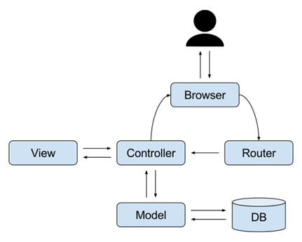

# PhocasExercise

# Short description
The program will generate and query Database of random peoples, and will output a json file
with the DB content
Open Java exercise.pdf for detailed description of the exercise

###  How to run
* Main program path: `src/main/java/app/Router`

### Notes
1. The program using the following extensions:
   1. sqlite to create local Database
   2. Faker to generate random data
   3. NDJSON to create and log json file

2. The program is following the MVC architectural pattern, please see below diagram:

